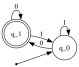
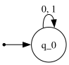
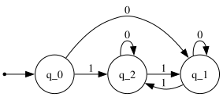
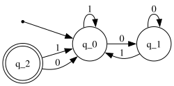
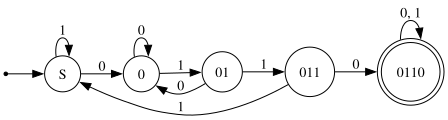
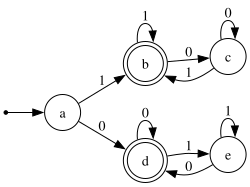

# deterministic finite automaton (dfa)

a dfa takes an input, and gives an output in the form of either
**accept** or **reject**.

## state machines

we usually use state diagrams to model how different automatons interact
with each other. consider this following state diagram, representing the
finite state machine $M_1$. $M_1$ takes a string input consisting of
`0`s and `1`s.

**info**: in the notes, i sometimes use the words dfa and state machine
interchangeably, however, it is not technically correct. a deterministic
finite automaton (dfa) is a specific type of finite state machine (fsm);
and while all dfas are fsms, it is not the same other way around. keep
it in your mind while reading :))

### components

there are two possible states for this automaton: $q_0$, $q_1$. a state
with double circles ($q_1$) means that it represents an _accept state_,
and a state with a single circle ($q_0$) represents a _non-accept
(reject) state_.

the arrows represent transition functions; which indaicates the change
of state based on an input. the state where the arrow pointing from
nowhere means that it is a **start state** $q_0$.

formally, a deterministic finite automaton $M$ can be defined as a five
tuple:

$$ M = (Q, \Sigma, \delta, q_0, F) $$

where:

- $Q$ is a non-empty finite set of states
- $\Sigma$ is an **alphabet** (a finite set of symbols)
- $\delta: Q \times \Sigma \rightarrow Q$ is the transition functions
- $q_0 \in Q$ is the starting state
  - a finite automata can only have _exactly one_ start state
- $F \subseteq Q$ is the set of accept states
  - $F$ can be $\emptyset \leadsto M$ can have no accept state (reject
    all strings)
  - $|F|$ can be more than 1 $\leadsto M$ has more than one accept
    states

#### example 1

consider this state machine: $M_1$.

this state machine takes a string as the input, where
$\Sigma := \{0, 1\}$. it rejects the input `01101`, $\epsilon$ (an empty
string), and accepts the input `10110`.

the state machine also accepts this input: `1011010101110010`, and also
this input: `0`. you might have noticed pattern -- this automaton
accepts any string that ends in a `0`. this is called the _language_ of
the automaton.

### language

to formalize the idea above: if $A$ is the set of _all strings_ accepted
by $M$, we can say that $A$ is the **language** of the finite state
machine $M$, denoted as the following:

$$ L(M) = A $$

in plain english, we say that $M$ recognizes $A$.

note: a machine may accept several string, but it always recognizes
_only one_ language.

## designing state machines

now since we know what a state machine is and what is a language, let's
try designing some state machines that only recognizes one language.

for all of these state machines, we assume that $\Sigma = \{0, 1\}$.

### example 1

**problem**: design a state machine $M$ where $L(M) = \emptyset$ ($M$
recognizes no languages).

**solution**: one approach is designing a state machine that will start
and end in a reject state regardless of the input.

we can make it a bit more complicated:

since this dfa also have no accept states, it will always end in a
reject state, no matter the input. however, let's look at this solution:

this solution also works, even though there is an accept state. however,
it is impossible to reach this state, as there are no arrows (transition
functions) that points to the accept state. when there exists a state
that have no arrows pointing to it, we call that state an **unreachable
state**.

note that these concepts also work the same for a state machine that
always end in an accept state. the machine either just don't have an
accept state, or the accept state is unreachable.

### example 2

**problem**: design a state machine $M$ such that its language is the
set of all strings that contain `0110` as a substring.

**solution**:

todo: explain, add common mistakes

### example 3

design a state machine $M$ such that its language is the set of all
strings that start and end with the same symbol.

todo: explain, add common mistakes
