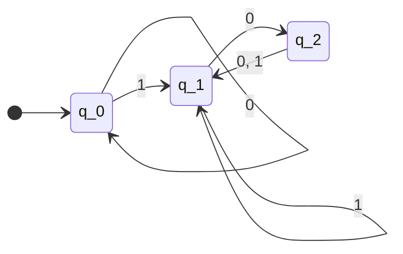
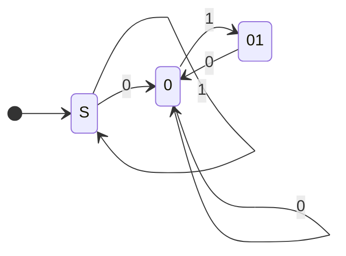
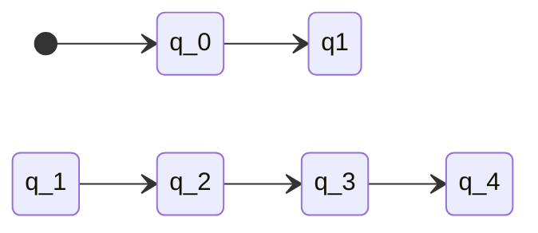
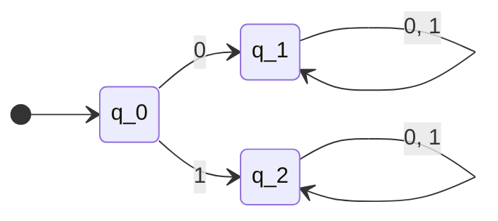

# deterministic finite automaton (dfa)

a dfa takes an input, and gives an output in the form of either
**accept** or **reject**.

## state machines

we usually use state diagrams to model how different automatons interact
with each other. consider this following state diagram, representing the
finite state machine $M_1$. $M_1$ takes a string input consisting of
`0`s and `1`s.

### components

there are two possible states for this automaton: $q_0$, $q_1$. a state
with double circles ($q_1$) means that it represents an _accept state_,
and a state with a single circle ($q_0$) represents a _non-accept
(reject) state_.

the arrows represent transition functions; which indaicates the change
of state based on an input. the state where the arrow pointing from
nowhere means that it is a **start state** $q_0$.

formally, a finite state machine $M$ can be defined as a five tuple:

$$ M = (Q, \Sigma, \delta, q_0, F) $$

where:

- $Q$ is a non-empty finite set of states
- $\Sigma$ is an **alphabet** (a finite set of symbols)
- $\delta: Q \times \Sigma \rightarrow Q$ is the transition functions
- $q_0 \in Q$ is the starting state
  - a finite automata can only have _exactly one_ start state
- $F \subseteq Q$ is the set of accept states
  - $F$ can be $\emptyset \leadsto M$ can have no accept state (reject
    all strings)
  - $|F|$ can be more than 1 $\leadsto M$ has more than one accept
    states

#### example 1

consider this state machine $M_1$.

- $M = (Q, \Sigma, \delta, q_0, F)$
  - $Q = \{q_0, q_1, q_2\}$
  - $\Sigma = \{0, 1\}$
  - $\delta$ can be described by this table below \

  | $\delta$ | 0     | 1    |
  | -------- | ----- | ---- |
  | $q_0$    | $q_0$ | $q_1 |

### language

consider the state machine $M_1$ shown above. you might have noticed a
pattern: when the end of the input is `0`, the state machine will always
end on a accept state. this is called the **language** of the state
machine.

#### example 1

design a state machine $D$ so that it ends on an accept state if the
input contains `0110`.

#### example 2

design a state machine $D$ such that it ends on an accept state if the
input _ends with_ `0110`.

#### example 3

design a state machine where its language is w | w starts with 1

#### example 4

start and end with the same symbol
