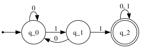
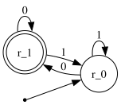

# combining dfas and operators

in the previous lecture we learned how to design dfas given a language.
how can we design a dfa that accepts many languages?

## combining dfas

to design a dfa that accept many languages, we first separate the larger
language into smaller languages, and then combine them. let's see an
example.

### example 1

**problem**: design a dfa $M$ such that its language is the set of
strings that contains 11 as a substring _or_ ends with 0.

**solution**: we can split this larger language into two smaller
languages (sets). the first set is the set of strings that contain 11.
we can design the first dfa $A$ like the following:

then, we design the dfa $B$ for the second language, where it is the set
of strings that end with 0.

to combine these small dfas together, we first enumerate all possible
states for $A$ and $B$ in tuples (the order does not matter):

- $(q_0, r_0)$
- $(q_1, r_0)$
- $(q_2, r_0)$
- $(q_0, r_1)$
- $(q_1, r_1)$
- $(q_2, r_1)$

this is the set of all possible states ($Q$) of $M$. you might have
notices it is a cartesian product of the states for the dfas $A$ and
$B$; where $Q_M = Q_A \times Q_B$.

then we redraw the transition functions by executing both dfas at the
same time. for each input, we draw the transition function pointing to
the state of both machines at the same time.

im so sorry... <a href="./static/combine.png">here</a> is a better
image

### combining dfas, formally

given a dfa $B = (Q_B, \Sigma, \delta_B, q_B, F_B)$, and another dfa $C
= (Q_C, \Sigma, \delta_C, q_C, F_C)$;

to construct a dfa $A = (Q_A, \Sigma, \delta_A, q_A, F_A)$ where $L(A) =
L(B) \cup L(C)$, we write that:

$$
  Q_A = Q_B \times Q_C = \{(q, r) \mid q \in Q_B \land r \in Q_C\}
$$

where its transition functions are:

$$
  \delta_A((q, r), a) = (\delta_B(q, a), \delta_C(r, a))
$$

and its states:

$$
  q_A = (q_B, q_C)
$$

finally, accept states:

$$
  F_A = \{(q, r) \mid q \in F_B \lor F_C\}
$$

### regular languages

a language $B$ is **regular** if there exists a dfa $A$ that recognizes
it ($L(A) = B$).

if we can prove that a language is _regular_, we _must_ be able to
construct a finite state machine to recognize it.

if we can prove that a language is _not regular_, we cannot construct a
finite state machine to recognize it.

given regular languages $A$ and $B$ (recognized by dfas $M_A$ and
$M_B$), $A \cup B$ is a **regular language**.

## regular (language) operators

operators are similar both in arithmetic and in theory of computation.

in arithmetic, objects are _numbers_, and tools are operations for
manipulating _numbers_.

in theorey of computation, objects are _languages_ (sets of strings),
and tools are operations for manipulating _languages_.

assume the languages $A$ and $B$; we define the regular operations are
following:

- **union**: $A \cup B = \{w \mid w \in A \lor w \in B \}$
  - same as in set theory
  - **theorem**: if $A$ and $B$ are regular languages, $A \cup B$ is a
    regular language.
- **concatenation**:
  $A \cdot B = AB = \{xy \mid x \in A \land y \in B\}$
  - let $A = \{00, 11\}$ and $B = \{010, 101\}$
  - $A \cdot B = {00010, 00101, 11010, 11101}$
- **kleene star**:
  $A^* = \{x_1x_2...x_k \mid k \geq 0 \land x_i \in A \}$
  - $\{\epsilon\} \cup A \cup AA \cup AAA \cup AAAA \cup ...$
    ($\epsilon$ is the empty string)
  - example: let $A = \{00, 11\}$; $A^* = \{\epsilon, 00, 11, 0000,
  0011, 1100, 1111, 000000, ...\}$
  - when $A = \emptyset$, $A^* = \{\epsilon\}$.
