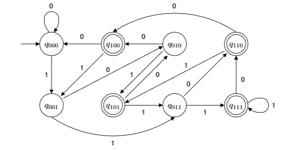
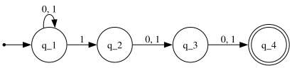

# non-deterministic finite automaton (nfa)

in a dfa, we are always able to determine the current and the next state
of the automaton, given an input. in nfa, however, we would not be able
to know the state of the automaton until it has finished processing. for
example:

you might see the difference between an nfa and dfa already. in an nfa,
it may have none, one or many exiting arrows for each symbol; comparing
to dfa, which _always_ has exactly one exiting transition arrow for each
symbol in the alphabet.

also in dfa, there are no arrows with the label $\epsilon$. in nfa,
however, it may have zero, one, or many arrows labeled $\epsilon$.

to calculate an nfa, we draw a computationl tree; which traces the state
of the dfa. take the nfa above for example -- we want to compute the
machine with the input $010110$.

## nfa vs dfa

you might have noticed that to compute an nfa, it can split into
multiple copies, and it might have transition functions using
$\epsilon$. though the compute process is rather cumbersome, sometimes,
designing a nfa is easier than designing a dfa for a certain language.
for example:

**problem**: let $A$ be the language consisting of all strings over
$\{0,1\}$ containing a $1$ in the third position from the end (e.g.,
$000100$ is in $A$ but $0011$ is not in $A$).

designing a dfa for this problem would be quite complicated. it looks
like this:

however, a nfa is a lot easier:

the transition from $q_1$ to $q_2$ is our guess that this is the $1$ in
the third position from the end.

if our guess is wrong:

- the input string is shorter, it will end at reject state.
- the input string is longer, the machine will die but other one remains
  alive.

## formal definition

a nfa is also a 5-tuple, similar to dfa:

$$
  M = (Q, \Sigma, \delta, q_0, F)
$$

where:

- $Q$ is a finite set of states
- $\Sigma$ is a finite alphabet
- $\delta : Q \times \Sigma_\epsilon \rightarrow \mathcal{P}(Q)$ is the
  transition function
  - $\Sigma_\epsilon = \Sigma \cup \{\epsilon\}$ and
  - $\mathcal{P}(Q)$ is the _power set_ of $Q$. the power set of a set
    is like a tree; starting from $\emptyset$, constructed to $Q$ and
    containing all possible combinations.
- $q_0 \in Q$ is the start state
- $F \subseteq Q$ is the set of accept states

## powerset construction

> **theorem**: every nondeterministic finite automaton (nfa) have an
> equivalent deterministic finite automaton (dfa).

the transformation of an nfa to an dfa is called **powerset
construction**.

### without $\epsilon$

if there are no $\epsilon$ symbols, we can construct a dfa $M$ from an
nfa $N$ like this:

- **states**:
  $Q' = \mathcal{P}(Q) = \{\emptyset, \{q_0\}, \{q_1\}, \{q_0, q_1\}, ...\}$
- **transitions**: $\delta'(R, a) = \bigcup_{r \in R} \delta(r, a)$
- **accept states**: any state in the dfa that contains _at least one_
  accept state from the nfa.
- **start state**: $q'_0 = {q_0}$

### with $\epsilon$

to handle $\epsilon$, we use $E(R)$, which is defined as the following:

$$
E(R) = \{q \mid q \text{ can be reached from } R \text{ by travel along } 0 \text{ or more } \epsilon \text{ arrows}\}
$$

or in english, $E(R)$ is the set of all states reachable from $R$ just
by following $\epsilon$ arrows.

the process would still be the same as above, but

- **start state**: the new start state becomes $q'_0 = E({q_0})$
- **transitions**: we apply $E$ to the results of our transitions:
  $\delta'(R, a) = \bigcup_{r \in R} E(\delta(r, a))$.
