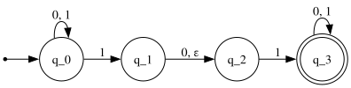
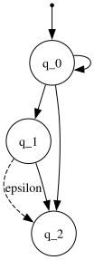

# non-deterministic finite automaton (nfa)

in a dfa, we are always able to determine the current and the next state
of the automaton, given an input. in nfa, however, we would not be able
to know the state of the automaton until it has finished processing. for
example:

todo: add abnormalities compared to dfa

in order to follow the state of a nfa, we draw a computational tree:

