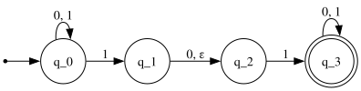
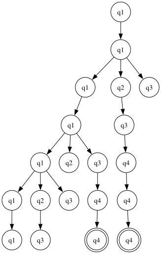

# non-deterministic finite automaton (nfa)

in a dfa, we are always able to determine the current and the next state
of the automaton, given an input. in nfa, however, we would not be able
to know the state of the automaton until it has finished processing. for
example:

you might see the difference between an nfa and dfa already. in an nfa,
it may have none, one or many exiting arrows for each symbol; comparing
to dfa, which _always_ has exactly one exiting transition arrow for each
symbol in the alphabet.

also in dfa, there are no arrows with the label $\epsilon$. in nfa,
however, it may have zero, one, or many arrows labeled $\epsilon$.

to calculate an nfa, we draw a computationl tree; which traces the state
of the dfa. take the nfa above for example -- we want to compute the
machine with the input $010110$.

