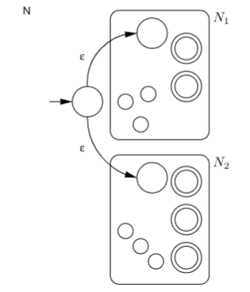
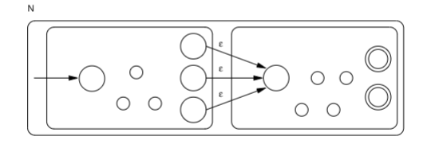
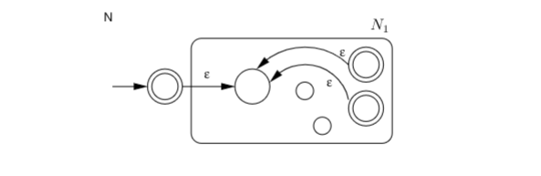

# closures

the set of all regular languages are closed under three operations --
meaning that the results after the operation will still be in the same
set -- **union**, **concatenation**, and **star**.

> **theorem**: the set of regular languages is closed under the regular
> operations.

## union

if $A$ and $B$ are regular languages, then $A \cup B$ is also regular.
this new regular language $C$ recognizes strings that are either in $A$
or in $B$.

we can construct a machine $N$ where $L(N) = L(N_1) \cup L(N_2)$ from
two machines $N_1$ and $N_2$ like this:

- draw the state diagram of $N_1$ on the top half
- draw the state diagram of $N_2$ on the bottom half
- add $\epsilon$ transitions from the new start state to the start
  states of $N_1$ and $N_2$ respectively.

it looks like this:

you might noticed the strange diagram. it might look complicated, but it
is simply an abstraction; each rounded box, or "bubble", is a finite
automaton; inside the box there are the all the states and transitions.

by abstracting away the detail in the automaton, it helps us to
visualize the operations better.

## concatenation

if $A$ and $B$ are regular languages, then $A \circ B$ (concatenation)
is regular too. this new language recognizes strings that start with
something in $A$ and end with something from $B$.

to construct the concatenation, we

- draw $A$ on the left and $B$ on the right
- for each accept state in $A$, add an $\epsilon$ transition pointing to
  the start state of $B$.
- change all the accept states of $A$ to regular non-accept state.

it looks like this:

## star operation

if $A$ is regular, $A*$ is also regular. the star operation recognizes
$\epsilon$ or any number of strings from $A$. to construct $A*$:

- draw the automaton of $A$.
- add a new start state and make it an accept state.
- add $\epsilon$ from the new start state to the original start state of
  $A$
- for each _original_ accept state of $A$, add $\epsilon$ transition to
  the _original_ start state of $A$.

it looks like this:

