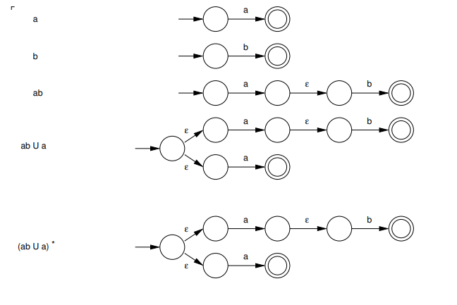

# regular expressions

## definition

a regular expression can be defined inductively over an alphabet
$\Sigma$:

- $\emptyset$ is a regular language
- $\epsilon$ is a regular language
- $a$ (as a singleton) for $a \in \Sigma$ is a regular language
- if $R_1$ and $R_2$ are regular, then $R_1 \cup R_2$ (union), $R_1 R_2$
  (concatenation), and $R_1^*$ (and $R_2^*$) (kleene star) are also
  regular.

## comparison to regular language

we use regular _expressions_ to describe what the regular _language_
(the set of accepted strings) is.

## new notations

other than the notations we have encountered before (union,
concatenation, star), we have two new ones:

- $R^+$ is a shorthand notation for $R R^*$ for a regular expression
  $R$.
  - all strings that are $1$ or more concatenations of string from $R$.
- $R^k$ is a shorthand notation for the repeat of $R$, $k$ times.
  - example: $1^5 = 11111$

## properties

in a regular expression, $*$ have the highest precedence, and $\cup$
have the lowest precedence.

some properties of languages:

- $R \epsilon = R$
  - concatenating an empty string yields the same language.
- $R \cup \emptyset = R$
  - same rationale as above
- $R \cup \{\epsilon\} \neq R$
  - it is _not_ like the above. we add an empty string to the language,
    so it can match an empty string.
- $R \emptyset = \emptyset$
  - any language concatenated with empty set is always an empty set.

> **lemma**: if a language is described by a regular expression, then it
> is regular.

## converting regex to nfa

we use each rule defined at the start one by one, to build an nfa from
regular expressions. for example:

this process follows 5 steps, each using one rule:

1. $a$ is a regular expression (rule 1)
2. $b$ is a regular expression (rule 1)
3. $a b$ is a regular expression (rule 5 with step 1 and 2)
4. $a b \cup a$ is a regular expression (rule 4 with steps 3 and 1)
5. $(a b \cup a)^*$ is a regular expression (rule 6 with step 4)

