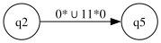
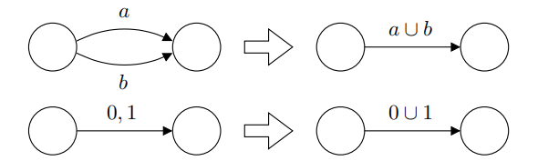

# generalized nondeterministic finit automaton (gnfa)

a gnfa ($N$) of a dfa ($M$) is a special type where $L(N) = L(M)$, where $N$ has exactly one accept state, and all transitions of $N$ are regular expressions.

example:

at $q_2$, if you encounter a string in the language $0^* \cup 11^*0$, move to state $q_5$.

$$
  0^* \cup 11^*0 = \{\epsilon, 0, 00, ...\} \cup \{10, 110, 1110, ...\}
$$

## converting dfa to gnfa

to convert a dfa to a gnfa, we need to:

1. start with a dfa $M$
2. add a new start state $s$ with an $\epsilon$ transition to the original start state of $M$
3. add a new accept state $a$
  - from every accept state of $M$, add an $\epsilon$ arrow to the new accept state
  - change all original accept states of $M$ to non-accept states
4. turn transition labels to regular expressions
5. add necessary transition arrows
  - change multiple arrows or multiple labels to a single arrow while label is the union of the previous labels, like this:

